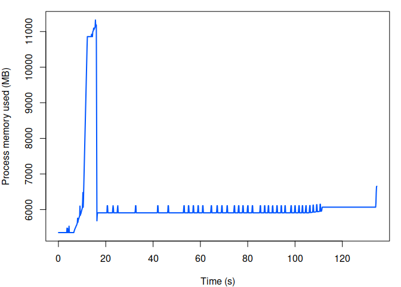

<!-- README.md is generated from README.Rmd. Please edit that file -->

# threemc_example

<!-- badges: start -->
<!-- badges: end -->

We’ve noticed that when running TMB memory is spiking during tape
optimisation and we would like to understand why. This is causing some
problems for running model for larger countries as it means we need to
run on a machine with \> 500GB of memory when this amount of memory is
only used for a small period of the model fit.

## Prerequisites

`readr`, `sf`, `TMB` and `threemc` packages

Install threemc from github

``` r
remotes::install_github("mrc-ide/threemc")
```

## Running

Run the script from the command line via `./script.R`

or from R with working dir set to root of this repo

``` r
source("threemc_fit.R")
threemc_fit()
```

## Profile

Run with profile from [memprof](https://github.com/mrc-ide/memprof)

``` r
source("threemc_fit.R")
mem <- memprof::with_monitor(threemc_fit())
#> Rows: 13200 Columns: 15
#> ── Column specification ───────────────────────────────────────────────────────────────────────────────────────────────────────────────────────────
#> Delimiter: ","
#> chr  (2): area_id, area_name
#> dbl (13): area_level, space, year, circ_age, time, age, population, N, obs_mmc, obs_tmc, obs_mc, cens, icens
#> 
#> ℹ Use `spec()` to retrieve the full column specification for this data.
#> ℹ Specify the column types or set `show_col_types = FALSE` to quiet this message.
#> area_lev arg missing, taken as maximum area level in shell dataset
#> Warning: as(<matrix>, "dgTMatrix") is deprecated since Matrix 1.5-0; do as(as(as(., "dMatrix"), "generalMatrix"), "TsparseMatrix") instead
#> rw_order = NULL, AR 1 temporal prior specified
#> Note: Using Makevars in /home/rashton/.R/Makevars 
#> Optimizing tape... Done
#> iter: 1  value: 30677.38 mgc: 1802.578 ustep: 0.004471122 
#> iter: 2  value: 25380.93 mgc: 4464.915 ustep: 0.06695976 
#> iter: 3  value: 24683.91 mgc: 885.9795 ustep: 0.25884 
#> iter: 4  value: 24607.01 mgc: 122.0315 ustep: 0.5088123 
#> iter: 5  value: 24579.46 mgc: 7.94225 ustep: 0.7133395 
#> iter: 6  value: 24562.69 mgc: 0.9279291 ustep: 0.8446098 
#> iter: 7  value: 24554.55 mgc: 0.2622005 ustep: 0.9190346 
#> iter: 8  value: 24551.88 mgc: 0.1184655 ustep: 0.9586671 
#> iter: 9  value: 24551.24 mgc: 0.05226711 ustep: 0.9791175 
#> iter: 10  value: 24551.11 mgc: 0.01545705 ustep: 0.9895047 
#> iter: 11  value: 24551.09 mgc: 0.003602017 ustep: 0.9947391 
#> iter: 12  value: 24551.08 mgc: 0.001068346 ustep: 0.9973663 
#> iter: 13  value: 24551.08 mgc: 0.0001979135 ustep: 0.9986824 
#> iter: 14  value: 24551.08 mgc: 2.024193e-05 ustep: 0.9993411 
#> iter: 15  value: 24551.08 mgc: 1.098987e-06 ustep: 0.9996705 
#> iter: 16  value: 24551.08 mgc: 3.092989e-08 ustep: 0.9998353 
#> iter: 17  mgc: 4.495252e-10 
#> iter: 1  mgc: 4.495252e-10 
#> Matching hessian patterns... Done
#> outer mgc:  65.30588 
#>   0:     24799.902: -5.00000 -5.00000  0.00000  0.00000  0.00000  0.00000  0.00000  0.00000  0.00000  0.00000  0.00000  2.00000  2.00000  2.00000  2.00000  2.00000  2.00000  2.00000  2.00000
#> iter: 1  value: 24631.81 mgc: 571.9599 ustep: 1 
#> iter: 2  value: 24541.38 mgc: 149.3102 ustep: 1 
#> iter: 3  value: 24539.98 mgc: 13.7529 ustep: 1 
#> iter: 4  value: 24539.98 mgc: 0.3035102 ustep: 1 
#> iter: 5  value: 24539.98 mgc: 0.0004400933 ustep: 1 
#> iter: 6  mgc: 3.848109e-09 
#> iter: 1  mgc: 3.848109e-09 
#> outer mgc:  25.97691 
#>   1:     24741.993: -5.00679 -5.32838 -0.00522034 -0.0178161 -0.0864361 -0.0169076 -0.327411 -0.785323 0.0328046 -0.0746412 0.203017  2.00389  2.14360  2.23295  2.00088  1.93830  2.07297  1.98468  1.83280
#> iter: 1  value: 24930.11 mgc: 1201.6 ustep: 1 
#> iter: 2  value: 24542.54 mgc: 980.3532 ustep: 1 
#> iter: 3  value: 24536.41 mgc: 116.4181 ustep: 1 
#> iter: 4  value: 24536.4 mgc: 2.467577 ustep: 1 
#> iter: 5  value: 24536.4 mgc: 0.001433313 ustep: 1 
#> iter: 6  mgc: 6.847873e-10 
#> iter: 1  mgc: 6.847873e-10 
#> outer mgc:  11.29983 
#>   2:     24713.882: -5.02996 -5.73514 -0.00677215 -0.136808 -0.277041 -0.0286519 -0.717780 -1.44764 0.0503917 -0.209496 0.0647044  2.04925  2.44490  2.37184  1.99843  1.79576  2.12476  1.97360  1.69336
#> iter: 1  value: 26234.28 mgc: 1533.288 ustep: 0.01776843 
#> iter: 2  value: 24612.1 mgc: 2561.588 ustep: 0.133385 
#> iter: 3  value: 24535.63 mgc: 448.8498 ustep: 0.3652825 
#> iter: 4  value: 24534.19 mgc: 33.84123 ustep: 0.6044256 
#> iter: 5  value: 24533.48 mgc: 0.407235 ustep: 0.7774704 
#> iter: 6  value: 24532.86 mgc: 0.06104803 ustep: 0.8817547 
#> iter: 7  value: 24532.39 mgc: 0.04456719 ustep: 0.939024 
#> iter: 8  value: 24532.13 mgc: 0.02903893 ustep: 0.9690356 
#> iter: 9  value: 24532.06 mgc: 0.01441364 ustep: 0.9843976 
#> iter: 10  value: 24532.04 mgc: 0.004937214 ustep: 0.9921689 
#> iter: 11  value: 24532.04 mgc: 0.001064362 ustep: 0.9960772 
#> iter: 12  value: 24532.04 mgc: 0.0002108239 ustep: 0.9980368 
#> iter: 13  value: 24532.04 mgc: 6.890513e-05 ustep: 0.999018 
#> iter: 14  value: 24532.04 mgc: 1.349569e-05 ustep: 0.9995089 
#> iter: 15  value: 24532.04 mgc: 1.600242e-06 ustep: 0.9997545 
#> iter: 16  value: 24532.04 mgc: 1.002482e-07 ustep: 0.9998772 
#> iter: 17  mgc: 3.200957e-09 
#> iter: 1  value: 25062.34 mgc: 2133.399 ustep: 0.002237842 
#> iter: 2  value: 24592.16 mgc: 890.109 ustep: 0.0474011 
#> iter: 3  value: 24533.42 mgc: 134.313 ustep: 0.2177962 
#> iter: 4  value: 24523.27 mgc: 9.477223 ustep: 0.4667397 
#> iter: 5  value: 24520.17 mgc: 0.734891 ustep: 0.6832152 
#> iter: 6  value: 24518.11 mgc: 0.1607941 ustep: 0.8265857 
#> iter: 7  value: 24516.19 mgc: 0.09238449 ustep: 0.9091766 
#> iter: 8  value: 24514.45 mgc: 0.05960613 ustep: 0.9535122 
#> iter: 9  value: 24513.13 mgc: 0.03988255 ustep: 0.9764818 
#> iter: 10  value: 24512.43 mgc: 0.02563292 ustep: 0.9881721 
#> iter: 11  value: 24512.21 mgc: 0.01234508 ustep: 0.9940691 
#> iter: 12  value: 24512.16 mgc: 0.003971484 ustep: 0.9970304 
#> iter: 13  value: 24512.15 mgc: 0.0007772426 ustep: 0.9985143 
#> iter: 14  value: 24512.15 mgc: 0.0002005145 ustep: 0.9992569 
#> iter: 15  value: 24512.15 mgc: 3.414822e-05 ustep: 0.9996284 
#> iter: 16  value: 24512.15 mgc: 3.446951e-06 ustep: 0.9998142 
#> iter: 17  value: 24512.15 mgc: 1.81292e-07 ustep: 0.9999071 
#> iter: 18  mgc: 4.853185e-09 
#> iter: 1  mgc: 4.853185e-09 
#> outer mgc:  36.16145 
#>   3:     24680.874: -5.13271 -7.49896 0.204471 -1.08941 -1.41887 0.312805 -1.27683 -2.51640 0.117245 -0.915739 -0.803757  2.48856  4.25950  2.22230  1.88847 0.717727  1.81224  1.91755 0.764795
#> iter: 1  value: 1018650 mgc: 86416.85 ustep: 0.0005598185 
#> iter: 2  value: 227687.8 mgc: 111006.3 ustep: 0.0007507445 
#> iter: 3  value: 59252.28 mgc: 12216.17 ustep: 0.001740415 
#> iter: 4  value: 43405.18 mgc: 8357.177 ustep: 0.001333237 
#> iter: 5  value: 31605.54 mgc: 5657.538 ustep: 0.004649853 
#> iter: 6  value: 27229.51 mgc: 3510.511 ustep: 0.06828301 
#> iter: 7  value: 25118.28 mgc: 1015.463 ustep: 0.261384 
#> iter: 8  value: 24453.64 mgc: 222.6352 ustep: 0.5113062 
#> iter: 9  value: 24380.16 mgc: 46.00494 ustep: 0.4661793 
#> iter: 10  value: 24340.05 mgc: 27.59509 ustep: 0.682805 
#> iter: 11  value: 24320.81 mgc: 10.46718 ustep: 0.8263375 
#> iter: 12  value: 24312.88 mgc: 2.502688 ustep: 0.9090402 
#> iter: 13  value: 24310.74 mgc: 0.5633965 ustep: 0.9534406 
#> iter: 14  value: 24310.37 mgc: 0.0680931 ustep: 0.9764452 
#> iter: 15  value: 24310.27 mgc: 0.0127366 ustep: 0.9881536 
#> iter: 16  value: 24310.23 mgc: 0.005596268 ustep: 0.9940598 
#> iter: 17  value: 24310.21 mgc: 0.001415441 ustep: 0.9970257 
#> iter: 18  value: 24310.21 mgc: 0.0004487698 ustep: 0.9985119 
#> iter: 19  value: 24310.21 mgc: 0.000126462 ustep: 0.9992558 
#> iter: 20  value: 24310.21 mgc: 2.246632e-05 ustep: 0.9996278 
#> iter: 21  value: 24310.21 mgc: 2.22378e-06 ustep: 0.9998139 
#> iter: 22  value: 24310.21 mgc: 1.157937e-07 ustep: 0.999907 
#> iter: 23  mgc: 3.099675e-09 
#> iter: 1  value: 173646.4 mgc: 39848.05 ustep: 0.002237842 
#> iter: 2  value: 39194.29 mgc: 24018.83 ustep: 0.01206452 
#> iter: 3  value: 37654.6 mgc: 6676.379 ustep: 0.05655787 
#> iter: 4  value: 25868.11 mgc: 8933.866 ustep: 0.2378952 
#> iter: 5  value: 24805.17 mgc: 1139.465 ustep: 0.4877962 
#> iter: 6  value: 24548.91 mgc: 294.2229 ustep: 0.6984543 
#> iter: 7  value: 24478.15 mgc: 97.94928 ustep: 0.8357522 
#> iter: 8  value: 24461.75 mgc: 28.66182 ustep: 0.9142034 
#> iter: 9  value: 24458.5 mgc: 5.773725 ustep: 0.9561442 
#> iter: 10  value: 24457.8 mgc: 0.5555595 ustep: 0.9778285 
#> iter: 11  value: 24457.68 mgc: 0.03856341 ustep: 0.9888532 
#> iter: 12  value: 24457.65 mgc: 0.002749754 ustep: 0.9944116 
#> iter: 13  value: 24457.64 mgc: 0.001007434 ustep: 0.9972021 
#> iter: 14  value: 24457.64 mgc: 0.0004440541 ustep: 0.9986002 
#> iter: 15  value: 24457.63 mgc: 0.0001240018 ustep: 0.9992999 
#> iter: 16  value: 24457.63 mgc: 2.0285e-05 ustep: 0.9996499 
#> iter: 17  value: 24457.63 mgc: 1.948226e-06 ustep: 0.999825 
#> iter: 18  value: 24457.63 mgc: 9.730264e-08 ustep: 0.9999125 
#> iter: 19  mgc: 2.469805e-09 
#> iter: 1  mgc: 2.469805e-09 
#> outer mgc:  36.72424 
#>   4:     24675.280: -5.10044 -7.13233 0.185887 -0.901762 -1.39339 0.717837 -1.19165 -2.38403 0.451958 -0.878538 0.352994  2.47794  4.35767  2.11112  1.89078 0.546876  1.70023  1.83193 0.398002
#> iter: 1  value: 26953.68 mgc: 3704.315 ustep: 0.001119436 
#> iter: 2  value: 24591.69 mgc: 6539.157 ustep: 0.03355462 
#> iter: 3  value: 24428.62 mgc: 1213.173 ustep: 0.1832609 
#> iter: 4  value: 24421.61 mgc: 127.7307 ustep: 0.428147 
#> iter: 5  value: 24420.61 mgc: 4.449587 ustep: 0.654364 
#> iter: 6  value: 24420.12 mgc: 0.09824413 ustep: 0.8089468 
#> iter: 7  value: 24419.72 mgc: 0.05033348 ustep: 0.8994248 
#> iter: 8  value: 24419.41 mgc: 0.03246252 ustep: 0.9483852 
#> iter: 9  value: 24419.24 mgc: 0.01778178 ustep: 0.9738533 
#> iter: 10  value: 24419.17 mgc: 0.007060706 ustep: 0.9868414 
#> iter: 11  value: 24419.15 mgc: 0.002849349 ustep: 0.9933996 
#> iter: 12  value: 24419.14 mgc: 0.0008039934 ustep: 0.9966947 
#> iter: 13  value: 24419.14 mgc: 0.0003272734 ustep: 0.9983461 
#> iter: 14  value: 24419.14 mgc: 0.0001069274 ustep: 0.9991728 
#> iter: 15  value: 24419.14 mgc: 2.0953e-05 ustep: 0.9995864 
#> iter: 16  value: 24419.14 mgc: 2.314586e-06 ustep: 0.9997932 
#> iter: 17  value: 24419.14 mgc: 1.381502e-07 ustep: 0.9998966 
#> iter: 18  mgc: 4.234899e-09 
#> iter: 1  mgc: 4.234899e-09 
#> outer mgc:  9.705371 
#>   5:     24647.628: -5.09634 -6.86541 0.105937 -0.624060 -1.40099 0.651196 -1.29113 -2.54416 0.759662 -0.831511 -0.369965  2.49504  5.11267  1.93482  1.90548 0.0957994  1.47448  1.73951 -0.184007
#> iter: 1  value: 29991.24 mgc: 1847.142 ustep: 1 
#> iter: 2  value: 28318.15 mgc: 10748.39 ustep: 0.01776843 
#> iter: 3  value: 27961.7 mgc: 3747.662 ustep: 0.03515011 
#> iter: 4  value: 27687.46 mgc: 1342.632 ustep: 0.02562289 
#> iter: 5  value: 26981.25 mgc: 1573.794 ustep: 0.01084497 
#> iter: 6  value: 24822.97 mgc: 529.8144 ustep: 0.006853012 
#> iter: 7  value: 24541.81 mgc: 650.2126 ustep: 0.08287464 
#> iter: 8  value: 24429.09 mgc: 391.079 ustep: 0.2879508 
#> iter: 9  value: 24415.92 mgc: 17.10702 ustep: 0.5366568 
#> iter: 10  value: 24411.88 mgc: 0.722289 ustep: 0.7325954 
#> iter: 11  value: 24410.58 mgc: 0.2205761 ustep: 0.8559323 
#> iter: 12  value: 24410.12 mgc: 0.08591348 ustep: 0.9251736 
#> iter: 13  value: 24409.94 mgc: 0.03070415 ustep: 0.9618632 
#> iter: 14  value: 24409.86 mgc: 0.01134378 ustep: 0.9807482 
#> iter: 15  value: 24409.81 mgc: 0.004660799 ustep: 0.9903283 
#> iter: 16  value: 24409.79 mgc: 0.002324204 ustep: 0.9951529 
#> iter: 17  value: 24409.78 mgc: 0.001010122 ustep: 0.9975737 
#> iter: 18  value: 24409.78 mgc: 0.0003514585 ustep: 0.9987863 
#> iter: 19  value: 24409.78 mgc: 8.10403e-05 ustep: 0.999393 
#> iter: 20  value: 24409.78 mgc: 1.105014e-05 ustep: 0.9996965 
#> iter: 21  value: 24409.78 mgc: 8.218648e-07 ustep: 0.9998482 
#> iter: 22  value: 24409.78 mgc: 3.211883e-08 ustep: 0.9999241 
#> iter: 23  mgc: 6.478614e-10 
#> iter: 1  value: 24428.43 mgc: 1056.459 ustep: 1 
#> iter: 2  value: 24414.9 mgc: 190.3792 ustep: 1 
#> iter: 3  value: 24414.87 mgc: 3.799054 ustep: 1 
#> iter: 4  value: 24414.87 mgc: 0.01476805 ustep: 1 
#> iter: 5  value: 24414.87 mgc: 1.475373e-06 ustep: 1 
#> iter: 6  mgc: 1.524092e-11 
#> iter: 1  mgc: 1.524092e-11 
#> outer mgc:  8.165928 
#>   6:     24643.572: -5.05970 -6.79608 0.0905442 -0.524767 -1.37743 0.994985 -1.23187 -2.48466 0.777055 -0.809720 -0.586993  2.52317  5.17207  1.81198  1.90888 -0.00660446  1.35843  1.72619 -0.420368
#> iter: 1  value: 24403.14 mgc: 2851.52 ustep: 1 
#> iter: 2  value: 24388.9 mgc: 382.9088 ustep: 1 
#> iter: 3  value: 24388.89 mgc: 12.52568 ustep: 1 
#> iter: 4  value: 24388.89 mgc: 0.01743177 ustep: 1 
#> iter: 5  value: 24388.89 mgc: 4.650495e-08 ustep: 1 
#> mgc: 1.650102e-11 
#> iter: 1  mgc: 1.650102e-11 
#> outer mgc:  12.45032 
#>   7:     24639.776: -5.05220 -6.73820 0.0713100 -0.514321 -1.36677 0.774031 -1.22599 -2.45559 0.838531 -0.805057 -0.428733  2.57352  5.46903  1.68069  1.91117 -0.182533  1.24000  1.69827 -0.650742
#> iter: 1  value: 24354.91 mgc: 485.8403 ustep: 1 
#> iter: 2  value: 24337.4 mgc: 67.221 ustep: 1 
#> iter: 3  value: 24337.28 mgc: 3.678268 ustep: 1 
#> iter: 4  value: 24337.28 mgc: 0.07262041 ustep: 1 
#> iter: 5  value: 24337.28 mgc: 2.911338e-05 ustep: 1 
#> iter: 6  mgc: 8.895551e-12 
#> iter: 1  mgc: 8.895551e-12 
#> outer mgc:  6.898587 
#>   8:     24631.302: -5.02093 -6.81746 0.0418047 -0.504681 -1.43420  1.23673 -1.36738 -2.52679 0.884694 -0.854284 -0.542215  2.73013  5.88695  1.33717  1.91227 -0.505615 0.937967  1.64705 -1.26112
#> iter: 1  value: 24298.95 mgc: 1588.595 ustep: 1 
#> iter: 2  value: 24283.37 mgc: 151.7779 ustep: 1 
#> iter: 3  value: 24283.31 mgc: 3.479847 ustep: 1 
#> iter: 4  value: 24283.31 mgc: 0.04921344 ustep: 1 
#> iter: 5  value: 24283.31 mgc: 1.134828e-05 ustep: 1 
#> iter: 6  mgc: 5.887082e-12 
#> iter: 1  mgc: 5.887082e-12 
#> outer mgc:  3.637557 
#>   9:     24624.581: -4.97580 -6.68855 -0.0130982 -0.114282 -1.24378  1.45811 -1.18683 -2.58084 0.895534 -0.714707 -0.407812  2.81647  6.30603 0.814862  1.91872 -0.847974 0.459406  1.59218 -1.40130
#> iter: 1  value: 24246.05 mgc: 3049.232 ustep: 1 
#> iter: 2  value: 24229.34 mgc: 388.9973 ustep: 1 
#> iter: 3  value: 24229.3 mgc: 11.82671 ustep: 1 
#> iter: 4  value: 24229.3 mgc: 0.02340229 ustep: 1 
#> iter: 5  value: 24229.3 mgc: 1.452922e-06 ustep: 1 
#> iter: 6  mgc: 6.389556e-12 
#> iter: 1  mgc: 6.389556e-12 
#> outer mgc:  5.726393 
#>  10:     24620.067: -4.92305 -6.55299 -0.0360125 -0.481025 -1.38160  1.62814 -1.43669 -2.57117 0.944529 -0.858401 -0.251538  3.09622  6.61766 0.305230  1.91739 -1.17304 0.0617012  1.53540 -1.77693
#> iter: 1  value: 24196.79 mgc: 1613.281 ustep: 1 
#> iter: 2  value: 24169.35 mgc: 416.1275 ustep: 1 
#> iter: 3  value: 24169.26 mgc: 14.47543 ustep: 1 
#> iter: 4  value: 24169.26 mgc: 0.1092558 ustep: 1 
#> iter: 5  value: 24169.26 mgc: 3.78227e-05 ustep: 1 
#> iter: 6  mgc: 9.882983e-12 
#> iter: 1  value: 24032.51 mgc: 1512.317 ustep: 1 
#> iter: 2  value: 23986.19 mgc: 539.1518 ustep: 1 
#> iter: 3  value: 23985.86 mgc: 32.68423 ustep: 1 
#> iter: 4  value: 23985.86 mgc: 0.2772657 ustep: 1 
#> iter: 5  value: 23985.86 mgc: 5.948904e-05 ustep: 1 
#> iter: 6  mgc: 6.62892e-12 
#> iter: 1  mgc: 6.62892e-12 
#> outer mgc:  13.75626 
#>  11:     24610.287: -4.78074 -6.66250 -0.0733190 -0.0261167 -1.68147  1.98556 -1.26471 -3.27267 0.672889 -1.04639 -0.0946205  3.44151  7.29029 -1.67362  1.89295 -1.89929 -1.34703  1.39758 -2.18305
#> iter: 1  value: 23956.08 mgc: 9183.608 ustep: 1 
#> iter: 2  value: 23665.53 mgc: 1665.549 ustep: 1 
#> iter: 3  value: 23660.7 mgc: 150.5775 ustep: 1 
#> iter: 4  value: 23660.7 mgc: 3.588032 ustep: 1 
#> iter: 5  value: 23660.7 mgc: 0.02223334 ustep: 1 
#> iter: 6  value: 23660.7 mgc: 8.095777e-07 ustep: 1 
#> mgc: 2.961187e-12 
#> iter: 1  mgc: 2.961187e-12 
#> outer mgc:  12.27677 
#>  12:     24601.555: -4.64670 -6.45718 -0.141978 0.00402493 -1.31875  2.52482 -0.795889 -3.89812 0.927151 -0.756893 -0.102276  3.93120  7.49556 -3.82350  1.87834 -2.04081 -2.74068  1.19272 -2.55939
#> iter: 1  value: 23421.11 mgc: 2838.376 ustep: 1 
#> iter: 2  value: 23410.03 mgc: 367.2885 ustep: 1 
#> iter: 3  value: 23410.01 mgc: 9.815299 ustep: 1 
#> iter: 4  value: 23410.01 mgc: 0.01166017 ustep: 1 
#> iter: 5  value: 23410.01 mgc: 1.535516e-06 ustep: 1 
#> iter: 6  mgc: 5.578727e-12 
#> iter: 1  mgc: 5.578727e-12 
#> outer mgc:  9.378273 
#>  13:     24597.462: -4.38340 -6.28477 -0.205301 0.218828 -0.912321  2.12108 -0.531164 -4.11604 0.989510 -0.819765 -0.0533164  4.28243  6.85854 -6.30461  1.87199 -2.42276 -3.39321  1.12490 -3.21595
#> iter: 1  value: 23255.17 mgc: 1062.969 ustep: 1 
#> iter: 2  value: 23184.09 mgc: 494.4594 ustep: 1 
#> iter: 3  value: 23180.89 mgc: 91.29856 ustep: 1 
#> iter: 4  value: 23180.87 mgc: 5.615045 ustep: 1 
#> iter: 5  value: 23180.87 mgc: 0.03136074 ustep: 1 
#> iter: 6  value: 23180.87 mgc: 1.285556e-06 ustep: 1 
#> iter: 7  mgc: 2.971678e-12 
#> iter: 1  mgc: 2.971678e-12 
#> outer mgc:  4.12791 
#>  14:     24590.167: -4.48472 -6.24917 -0.326153 0.521712 -1.08153  1.96848 -0.402565 -4.23645 0.893053 -0.782219 0.193333  4.56674  6.49952 -9.06535  1.87732 -2.29033 -3.81169  1.09237 -3.20727
#> iter: 1  value: 23001.31 mgc: 1279.821 ustep: 1 
#> iter: 2  value: 22961.78 mgc: 161.7235 ustep: 1 
#> iter: 3  value: 22961.49 mgc: 7.348332 ustep: 1 
#> iter: 4  value: 22961.49 mgc: 0.0880631 ustep: 1 
#> iter: 5  value: 22961.49 mgc: 7.267517e-05 ustep: 1 
#> iter: 6  mgc: 2.107675e-10 
#> iter: 1  value: 23132.91 mgc: 905.2308 ustep: 1 
#> iter: 2  value: 23132.08 mgc: 86.58923 ustep: 1 
#> iter: 3  value: 23132.08 mgc: 0.6550974 ustep: 1 
#> iter: 4  value: 23132.08 mgc: 4.641708e-05 ustep: 1 
#> iter: 5  mgc: 4.111156e-12 
#> iter: 1  mgc: 4.111156e-12 
#> outer mgc:  3.944374 
#>  15:     24588.506: -4.63237 -6.45495 -0.316910 0.454594 -1.27165  2.06606 -0.181691 -4.27617 0.894697 -0.808336 0.200317  4.65808  6.52351 -9.68217  1.87499 -2.18046 -3.63188  1.09117 -3.29396
#> iter: 1  value: 23051.61 mgc: 116.3967 ustep: 1 
#> iter: 2  value: 23051.45 mgc: 14.62621 ustep: 1 
#> iter: 3  value: 23051.45 mgc: 0.1659717 ustep: 1 
#> iter: 4  value: 23051.45 mgc: 4.876025e-05 ustep: 1 
#> iter: 5  mgc: 8.550972e-12 
#> iter: 1  mgc: 8.550972e-12 
#> outer mgc:  2.122929 
#>  16:     24587.589: -4.74591 -6.64842 -0.235158 0.507745 -1.20556  2.13096 -0.330877 -4.23199 0.950247 -0.640162 0.223828  4.64434  6.79959 -10.2874  1.85795 -2.20347 -3.45599  1.14762 -3.22586
#> iter: 1  value: 23034.5 mgc: 924.6971 ustep: 1 
#> iter: 2  value: 23033.22 mgc: 111.0747 ustep: 1 
#> iter: 3  value: 23033.22 mgc: 1.294262 ustep: 1 
#> iter: 4  value: 23033.22 mgc: 0.0002408346 ustep: 1 
#> iter: 5  mgc: 9.909407e-12 
#> iter: 1  mgc: 9.909407e-12 
#> outer mgc:  2.077662 
#>  17:     24586.588: -4.74612 -6.47345 -0.128567 0.548779 -1.16879  2.13812 -0.511233 -4.04075 0.849969 -0.828859 0.174941  4.56144  7.01008 -10.7192  1.84020 -2.01339 -3.08056  1.30205 -3.15052
#> iter: 1  value: 23094.15 mgc: 3021.721 ustep: 1 
#> iter: 2  value: 23083.47 mgc: 378.0433 ustep: 1 
#> iter: 3  value: 23083.45 mgc: 10.99452 ustep: 1 
#> iter: 4  value: 23083.45 mgc: 0.01518559 ustep: 1 
#> iter: 5  value: 23083.45 mgc: 5.795428e-08 ustep: 1 
#> mgc: 8.226524e-12 
#> iter: 1  mgc: 8.226524e-12 
#> outer mgc:  2.304945 
#>  18:     24586.359: -4.53679 -6.34902 -0.0545873 0.525561 -1.50552  2.10095 -0.680148 -3.76804 0.956010 -0.728489 0.0725476  4.46273  7.07605 -10.6420  1.82598 -1.92763 -2.61977  1.37042 -2.93281
#> iter: 1  value: 23390.92 mgc: 2365.514 ustep: 1 
#> iter: 2  value: 23150.87 mgc: 1750.574 ustep: 1 
#> iter: 3  value: 23147.64 mgc: 183.7886 ustep: 1 
#> iter: 4  value: 23147.64 mgc: 3.31023 ustep: 1 
#> iter: 5  value: 23147.64 mgc: 0.001436723 ustep: 1 
#> iter: 6  mgc: 4.429395e-10 
#> iter: 1  mgc: 4.429395e-10 
#> outer mgc:  3.048192 
#>  19:     24585.941: -4.41691 -6.52558 -0.0708148 0.372443 -1.40218  2.14128 -0.769882 -3.45476 0.802749 -0.769676 -0.00624229  4.42366  7.11678 -10.3068  1.82157 -1.95050 -2.26988  1.36716 -2.54666
#> iter: 1  value: 23350.06 mgc: 9558.27 ustep: 1 
#> iter: 2  value: 23175.39 mgc: 1852.101 ustep: 1 
#> iter: 3  value: 23171.48 mgc: 198.2361 ustep: 1 
#> iter: 4  value: 23171.47 mgc: 5.633134 ustep: 1 
#> iter: 5  value: 23171.47 mgc: 0.01119528 ustep: 1 
#> iter: 6  value: 23171.47 mgc: 8.507991e-08 ustep: 1 
#> mgc: 1.411804e-11 
#> iter: 1  value: 23155.04 mgc: 1360.28 ustep: 1 
#> iter: 2  value: 23153.55 mgc: 120.9901 ustep: 1 
#> iter: 3  value: 23153.55 mgc: 1.725115 ustep: 1 
#> iter: 4  value: 23153.55 mgc: 0.0007169502 ustep: 1 
#> iter: 5  mgc: 2.673857e-10 
#> iter: 1  mgc: 2.673857e-10 
#> outer mgc:  1.71032 
#>  20:     24585.621: -4.50730 -6.57433 -0.0922429 0.383855 -1.36879  2.15990 -0.783590 -3.40080 0.897178 -0.851408 -0.0853030  4.39439  7.07137 -10.3250  1.81796 -1.93862 -2.31580  1.32118 -2.51161
#> iter: 1  value: 23138.29 mgc: 371.3887 ustep: 1 
#> iter: 2  value: 23138.22 mgc: 12.90036 ustep: 1 
#> iter: 3  value: 23138.22 mgc: 0.02251916 ustep: 1 
#> iter: 4  value: 23138.22 mgc: 2.7832e-07 ustep: 1 
#> mgc: 1.042967e-11 
#> iter: 1  mgc: 1.042967e-11 
#> outer mgc:  0.9468035 
#>  21:     24585.413: -4.59558 -6.52598 -0.116466 0.362838 -1.36167  2.12395 -0.719730 -3.41649 0.867106 -0.817565 -0.107591  4.40515  7.04543 -10.4451  1.81628 -1.96677 -2.41916  1.31019 -2.52656
#> iter: 1  value: 23122.2 mgc: 232.7384 ustep: 1 
#> iter: 2  value: 23122.2 mgc: 4.534483 ustep: 1 
#> iter: 3  value: 23122.2 mgc: 0.001999408 ustep: 1 
#> iter: 4  mgc: 5.546124e-10 
#> iter: 1  mgc: 5.546124e-10 
#> outer mgc:  0.55024 
#>  22:     24585.266: -4.63619 -6.51617 -0.130589 0.346516 -1.35645  2.12288 -0.683764 -3.40447 0.876909 -0.825229 -0.105818  4.38542  7.02644 -10.5797  1.80968 -1.98390 -2.55763  1.29386 -2.46401
#> iter: 1  value: 23122.01 mgc: 713.4407 ustep: 1 
#> iter: 2  value: 23121.68 mgc: 56.79039 ustep: 1 
#> iter: 3  value: 23121.68 mgc: 0.3654985 ustep: 1 
#> iter: 4  value: 23121.68 mgc: 2.583382e-05 ustep: 1 
#> iter: 5  mgc: 1.403078e-11 
#> iter: 1  mgc: 1.403078e-11 
#> outer mgc:  1.665427 
#>  23:     24585.240: -4.68956 -6.51436 -0.139726 0.340085 -1.34702  2.11311 -0.692851 -3.33461 0.834539 -0.764332 -0.120559  4.31786  6.96588 -10.6621  1.79884 -1.93155 -2.67820  1.28881 -2.45324
#> iter: 1  value: 23121.02 mgc: 549.0507 ustep: 1 
#> iter: 2  value: 23120.97 mgc: 23.46238 ustep: 1 
#> iter: 3  value: 23120.97 mgc: 0.05987685 ustep: 1 
#> iter: 4  value: 23120.97 mgc: 6.483597e-07 ustep: 1 
#> mgc: 2.03785e-11 
#> iter: 1  mgc: 2.03785e-11 
#> outer mgc:  0.5346426 
#>  24:     24585.155: -4.71276 -6.53734 -0.155387 0.320428 -1.32231  2.07902 -0.626731 -3.25868 0.872991 -0.782881 -0.138278  4.20219  6.95769 -10.7256  1.77907 -1.90794 -2.73823  1.27550 -2.36132
#> iter: 1  value: 23113.62 mgc: 162.455 ustep: 1 
#> iter: 2  value: 23113.62 mgc: 3.088356 ustep: 1 
#> iter: 3  value: 23113.62 mgc: 0.006210789 ustep: 1 
#> iter: 4  value: 23113.62 mgc: 2.828373e-08 ustep: 1 
#> mgc: 1.42862e-11 
#> iter: 1  mgc: 1.42862e-11 
#> outer mgc:  0.1837379 
#>  25:     24585.145: -4.70972 -6.50987 -0.142711 0.284984 -1.34760  2.10711 -0.605756 -3.24580 0.876724 -0.810164 -0.157285  4.20004  7.01830 -10.6960  1.75629 -1.92731 -2.79409  1.29501 -2.31785
#> iter: 1  value: 23114.74 mgc: 160.2602 ustep: 1 
#> iter: 2  value: 23114.73 mgc: 2.363912 ustep: 1 
#> iter: 3  value: 23114.73 mgc: 0.0006821839 ustep: 1 
#> iter: 4  mgc: 1.249973e-10 
#> iter: 1  mgc: 1.249973e-10 
#> outer mgc:  0.1984866 
#>  26:     24585.139: -4.68779 -6.52647 -0.146396 0.294134 -1.34039  2.09065 -0.621208 -3.23333 0.870361 -0.799640 -0.146546  4.20646  6.99222 -10.7329  1.74599 -1.92051 -2.76397  1.27876 -2.34534
#> iter: 1  value: 23119.54 mgc: 142.5937 ustep: 1 
#> iter: 2  value: 23119.54 mgc: 1.87061 ustep: 1 
#> iter: 3  value: 23119.54 mgc: 0.0002768573 ustep: 1 
#> iter: 4  mgc: 3.829292e-11 
#> iter: 1  value: 23116.38 mgc: 50.1379 ustep: 1 
#> iter: 2  value: 23116.38 mgc: 0.2362735 ustep: 1 
#> iter: 3  value: 23116.38 mgc: 4.471799e-06 ustep: 1 
#> iter: 4  mgc: 1.019364e-11 
#> iter: 1  mgc: 1.019364e-11 
#> outer mgc:  0.03706008 
#>  27:     24585.137: -4.69902 -6.51988 -0.147732 0.296235 -1.33614  2.09348 -0.621958 -3.23261 0.871394 -0.795347 -0.145928  4.20317  6.98903 -10.7212  1.74028 -1.92556 -2.75001  1.28046 -2.34420
#> iter: 1  value: 23116.45 mgc: 29.45941 ustep: 1 
#> iter: 2  value: 23116.45 mgc: 0.07692517 ustep: 1 
#> iter: 3  value: 23116.45 mgc: 6.764901e-07 ustep: 1 
#> mgc: 1.174727e-11 
#> iter: 1  mgc: 1.174727e-11 
#> outer mgc:  0.01332401 
#>  28:     24585.137: -4.70334 -6.52038 -0.148915 0.293785 -1.33778  2.09505 -0.617862 -3.23036 0.873118 -0.797781 -0.145643  4.19910  6.99365 -10.7094  1.72496 -1.92274 -2.76129  1.28514 -2.34618
#> iter: 1  value: 23115.34 mgc: 20.37536 ustep: 1 
#> iter: 2  value: 23115.34 mgc: 0.03306897 ustep: 1 
#> iter: 3  value: 23115.34 mgc: 7.276096e-07 ustep: 1 
#> mgc: 9.393597e-12 
#> iter: 1  mgc: 9.393597e-12 
#> outer mgc:  0.04714667 
#>  29:     24585.137: -4.69987 -6.51813 -0.150256 0.292038 -1.33811  2.09765 -0.615341 -3.22717 0.873642 -0.798384 -0.146065  4.19680  6.99639 -10.7143  1.70211 -1.92514 -2.76348  1.28418 -2.34663
#> iter: 1  value: 23115.6 mgc: 2.146039 ustep: 1 
#> iter: 2  value: 23115.6 mgc: 0.002285681 ustep: 1 
#> iter: 3  mgc: 2.847809e-09 
#> iter: 1  mgc: 2.847809e-09 
#> outer mgc:  0.01549141 
#>  30:     24585.136: -4.70133 -6.51737 -0.151968 0.291037 -1.33847  2.09746 -0.616858 -3.22137 0.873299 -0.798466 -0.145745  4.19533  6.99702 -10.7123  1.67835 -1.92570 -2.76245  1.28322 -2.34691
#> iter: 1  value: 23115.79 mgc: 0.6019162 ustep: 1 
#> iter: 2  value: 23115.79 mgc: 0.0002702447 ustep: 1 
#> iter: 3  mgc: 5.222978e-11 
#> iter: 1  mgc: 5.222978e-11 
#> outer mgc:  0.01053795 
#>  31:     24585.136: -4.70053 -6.51819 -0.154386 0.291371 -1.33812  2.09691 -0.617207 -3.22009 0.873395 -0.798033 -0.144938  4.19558  6.99637 -10.7125  1.65385 -1.92484 -2.76169  1.28382 -2.34897
#> iter: 1  value: 23116.16 mgc: 12.9061 ustep: 1 
#> iter: 2  value: 23116.16 mgc: 0.01328701 ustep: 1 
#> iter: 3  value: 23116.16 mgc: 1.64999e-08 ustep: 1 
#> mgc: 1.197176e-11 
#> iter: 1  mgc: 1.197176e-11 
#> outer mgc:  0.0044087 
#>  32:     24585.136: -4.69993 -6.51895 -0.157297 0.292437 -1.33782  2.09626 -0.618039 -3.22197 0.872868 -0.797615 -0.144785  4.19718  6.99557 -10.7131  1.62622 -1.92396 -2.76002  1.28261 -2.34898
#> iter: 1  value: 23116.25 mgc: 1.097765 ustep: 1 
#> iter: 2  value: 23116.25 mgc: 0.0002031811 ustep: 1 
#> iter: 3  mgc: 1.805711e-11 
#> iter: 1  mgc: 1.805711e-11 
#> outer mgc:  0.002319757 
#>  33:     24585.136: -4.69975 -6.51918 -0.157911 0.292894 -1.33779  2.09613 -0.618111 -3.22423 0.873058 -0.797557 -0.145121  4.19811  6.99546 -10.7133  1.62208 -1.92376 -2.75990  1.28392 -2.34801
#> iter: 1  value: 23116.31 mgc: 4.186625 ustep: 1 
#> iter: 2  value: 23116.31 mgc: 0.001406155 ustep: 1 
#> iter: 3  mgc: 1.727098e-10 
#> iter: 1  mgc: 1.727098e-10 
#> outer mgc:  0.000570702 
#>  34:     24585.136: -4.69991 -6.51915 -0.158021 0.293044 -1.33784  2.09617 -0.618002 -3.22570 0.872864 -0.797687 -0.145402  4.19843  6.99555 -10.7131  1.62193 -1.92364 -2.75996  1.28319 -2.34729
#> iter: 1  value: 23116.29 mgc: 1.561463 ustep: 1 
#> iter: 2  value: 23116.29 mgc: 0.000196808 ustep: 1 
#> iter: 3  mgc: 1.119208e-11 
#> iter: 1  mgc: 1.119208e-11 
#> outer mgc:  8.61901e-05 
#>  35:     24585.136: -4.69989 -6.51914 -0.157949 0.292999 -1.33784  2.09619 -0.618008 -3.22565 0.872948 -0.797670 -0.145408  4.19835  6.99557 -10.7132  1.62264 -1.92369 -2.76002  1.28355 -2.34727
#> iter: 1  mgc: 1.119208e-11
plot(mem)
```

<!-- -->
