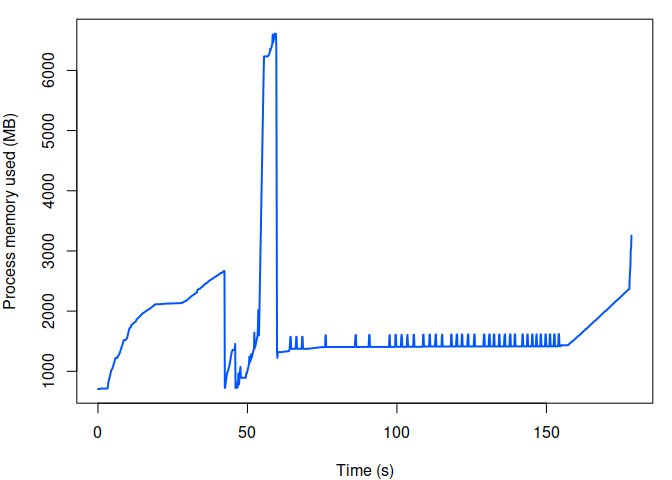

<!-- README.md is generated from README.Rmd. Please edit that file -->

# threemc_example

We’ve noticed that when running TMB, system memory is spiking during
tape optimisation and we would like to understand why. Below is a plot
of memory usage when running the model with a relatively large country
(Ghana)

<!-- -->

The memory is spiking during tape optimisation which means we need to
run on a machine with \> 500GB of memory. These are the biggest cluster
nodes we have available, meaning we’re sitting on a huge amount of
compute which we only really need for a small fraction of the model fit.
If we were able to reduce the memory usage we could run more concurrent
models. We’re trying to understand

- Why does the memory spike like this?
- Can we predict the size of the memory spike from size in input data,
  number of parameters etc.
- Can we save out the optimised tape and then use this for multiple
  model fits? This could allow us to do the costly optimisation on a
  beefy node but then run the rest of the simulation on smaller nodes.

This repo contains an example of a smaller model fit which can be run
with about 11GB of RAM but still shows the memory spike during
optimisation.

## Prerequisites

`readr`, `sf`, `TMB` and `threemc` packages

Install threemc from github

``` r
remotes::install_github("mrc-ide/threemc")
```

## Running

Run the script from the command line via `./script.R` (working directory
must be this repo root)q

or from R as

    source("threemc_fit.R")
    shell_dat <- readr::read_csv("data/shell_data_lso.csv.gz")
    areas <- sf::read_sf("data/areas.geojson")
    mod <- readLines("src/threemc.cpp")
    fit <- threemc_fit(shell_dat, areas, mod, silent = TRUE)

## Profile

Run with profile from [memprof](https://github.com/mrc-ide/memprof)

``` r
source("threemc_fit.R")
# load shell dataset
shell_dat <- readr::read_csv("data/shell_data_lso.csv.gz")
#> Rows: 13200 Columns: 15
#> ── Column specification ───────────────────────────────────────────────────────────────────────────────────────────────────────────────────────────
#> Delimiter: ","
#> chr  (2): area_id, area_name
#> dbl (13): area_level, space, year, circ_age, time, age, population, N, obs_mmc, obs_tmc, obs_mc, cens, icens
#> 
#> ℹ Use `spec()` to retrieve the full column specification for this data.
#> ℹ Specify the column types or set `show_col_types = FALSE` to quiet this message.
# load shapefiles
areas <- sf::read_sf("data/areas.geojson")
# load text from C++ mod into R
mod <- readLines("src/threemc.cpp")
mem <- memprof::with_monitor(threemc_fit(shell_dat, areas, mod, silent = TRUE))
#> area_lev arg missing, taken as maximum area level in shell dataset
#> Warning: as(<matrix>, "dgTMatrix") is deprecated since Matrix 1.5-0; do as(as(as(., "dMatrix"), "generalMatrix"), "TsparseMatrix") instead
#> rw_order = NULL, AR 1 temporal prior specified
#> Note: Using Makevars in /home/rashton/.R/Makevars 
#>   0:     24799.902: -5.00000 -5.00000  0.00000  0.00000  0.00000  0.00000  0.00000  0.00000  0.00000  0.00000  0.00000  2.00000  2.00000  2.00000  2.00000  2.00000  2.00000  2.00000  2.00000
#>   1:     24741.993: -5.00679 -5.32838 -0.00522034 -0.0178161 -0.0864361 -0.0169076 -0.327411 -0.785323 0.0328046 -0.0746412 0.203017  2.00389  2.14360  2.23295  2.00088  1.93830  2.07297  1.98468  1.83280
#>   2:     24713.882: -5.02996 -5.73514 -0.00677215 -0.136808 -0.277041 -0.0286519 -0.717780 -1.44764 0.0503917 -0.209496 0.0647044  2.04925  2.44490  2.37184  1.99843  1.79576  2.12476  1.97360  1.69336
#>   3:     24680.874: -5.13271 -7.49896 0.204471 -1.08941 -1.41887 0.312805 -1.27683 -2.51640 0.117245 -0.915739 -0.803757  2.48856  4.25950  2.22230  1.88847 0.717727  1.81224  1.91755 0.764795
#>   4:     24675.280: -5.10044 -7.13233 0.185887 -0.901762 -1.39339 0.717837 -1.19165 -2.38403 0.451958 -0.878538 0.352994  2.47794  4.35767  2.11112  1.89078 0.546876  1.70023  1.83193 0.398002
#>   5:     24647.628: -5.09634 -6.86541 0.105937 -0.624060 -1.40099 0.651196 -1.29113 -2.54416 0.759662 -0.831511 -0.369965  2.49504  5.11267  1.93482  1.90548 0.0957994  1.47448  1.73951 -0.184007
#>   6:     24643.572: -5.05970 -6.79608 0.0905442 -0.524767 -1.37743 0.994985 -1.23187 -2.48466 0.777055 -0.809720 -0.586993  2.52317  5.17207  1.81198  1.90888 -0.00660446  1.35843  1.72619 -0.420368
#>   7:     24639.776: -5.05220 -6.73820 0.0713100 -0.514321 -1.36677 0.774031 -1.22599 -2.45559 0.838531 -0.805057 -0.428733  2.57352  5.46903  1.68069  1.91117 -0.182533  1.24000  1.69827 -0.650742
#>   8:     24631.302: -5.02093 -6.81746 0.0418047 -0.504681 -1.43420  1.23673 -1.36738 -2.52679 0.884694 -0.854284 -0.542215  2.73013  5.88695  1.33717  1.91227 -0.505615 0.937967  1.64705 -1.26112
#>   9:     24624.581: -4.97580 -6.68855 -0.0130982 -0.114282 -1.24378  1.45811 -1.18683 -2.58084 0.895534 -0.714707 -0.407812  2.81647  6.30603 0.814862  1.91872 -0.847974 0.459406  1.59218 -1.40130
#>  10:     24620.067: -4.92305 -6.55299 -0.0360125 -0.481025 -1.38160  1.62814 -1.43669 -2.57117 0.944529 -0.858401 -0.251538  3.09622  6.61766 0.305230  1.91739 -1.17304 0.0617012  1.53540 -1.77693
#>  11:     24610.287: -4.78074 -6.66250 -0.0733190 -0.0261167 -1.68147  1.98556 -1.26471 -3.27267 0.672889 -1.04639 -0.0946205  3.44151  7.29029 -1.67362  1.89295 -1.89929 -1.34703  1.39758 -2.18305
#>  12:     24601.555: -4.64670 -6.45718 -0.141978 0.00402493 -1.31875  2.52482 -0.795889 -3.89812 0.927151 -0.756893 -0.102276  3.93120  7.49556 -3.82350  1.87834 -2.04081 -2.74068  1.19272 -2.55939
#>  13:     24597.462: -4.38340 -6.28477 -0.205301 0.218828 -0.912321  2.12108 -0.531164 -4.11604 0.989510 -0.819765 -0.0533164  4.28243  6.85854 -6.30461  1.87199 -2.42276 -3.39321  1.12490 -3.21595
#>  14:     24590.167: -4.48472 -6.24917 -0.326153 0.521712 -1.08153  1.96848 -0.402565 -4.23645 0.893053 -0.782219 0.193333  4.56674  6.49952 -9.06535  1.87732 -2.29033 -3.81169  1.09237 -3.20727
#>  15:     24588.506: -4.63237 -6.45495 -0.316910 0.454594 -1.27165  2.06606 -0.181691 -4.27617 0.894697 -0.808336 0.200317  4.65808  6.52351 -9.68217  1.87499 -2.18046 -3.63188  1.09117 -3.29396
#>  16:     24587.589: -4.74591 -6.64842 -0.235158 0.507745 -1.20556  2.13096 -0.330877 -4.23199 0.950247 -0.640162 0.223828  4.64434  6.79959 -10.2874  1.85795 -2.20347 -3.45599  1.14762 -3.22586
#>  17:     24586.588: -4.74612 -6.47345 -0.128567 0.548779 -1.16879  2.13812 -0.511233 -4.04075 0.849969 -0.828859 0.174941  4.56144  7.01008 -10.7192  1.84020 -2.01339 -3.08056  1.30205 -3.15052
#>  18:     24586.359: -4.53679 -6.34902 -0.0545873 0.525561 -1.50552  2.10095 -0.680148 -3.76804 0.956010 -0.728489 0.0725476  4.46273  7.07605 -10.6420  1.82598 -1.92763 -2.61977  1.37042 -2.93281
#>  19:     24585.941: -4.41691 -6.52558 -0.0708148 0.372443 -1.40218  2.14128 -0.769882 -3.45476 0.802749 -0.769676 -0.00624229  4.42366  7.11678 -10.3068  1.82157 -1.95050 -2.26988  1.36716 -2.54666
#>  20:     24585.621: -4.50730 -6.57433 -0.0922429 0.383855 -1.36879  2.15990 -0.783590 -3.40080 0.897178 -0.851408 -0.0853030  4.39439  7.07137 -10.3250  1.81796 -1.93862 -2.31580  1.32118 -2.51161
#>  21:     24585.413: -4.59558 -6.52598 -0.116466 0.362838 -1.36167  2.12395 -0.719730 -3.41649 0.867106 -0.817565 -0.107591  4.40515  7.04543 -10.4451  1.81628 -1.96677 -2.41916  1.31019 -2.52656
#>  22:     24585.266: -4.63619 -6.51617 -0.130589 0.346516 -1.35645  2.12288 -0.683764 -3.40447 0.876909 -0.825229 -0.105818  4.38542  7.02644 -10.5797  1.80968 -1.98390 -2.55763  1.29386 -2.46401
#>  23:     24585.240: -4.68956 -6.51436 -0.139726 0.340085 -1.34702  2.11311 -0.692851 -3.33461 0.834539 -0.764332 -0.120559  4.31786  6.96588 -10.6621  1.79884 -1.93155 -2.67820  1.28881 -2.45324
#>  24:     24585.155: -4.71276 -6.53734 -0.155387 0.320428 -1.32231  2.07902 -0.626731 -3.25868 0.872991 -0.782881 -0.138278  4.20219  6.95769 -10.7256  1.77907 -1.90794 -2.73823  1.27550 -2.36132
#>  25:     24585.145: -4.70972 -6.50987 -0.142711 0.284984 -1.34760  2.10711 -0.605756 -3.24580 0.876724 -0.810164 -0.157285  4.20004  7.01830 -10.6960  1.75629 -1.92731 -2.79409  1.29501 -2.31785
#>  26:     24585.139: -4.68779 -6.52647 -0.146396 0.294134 -1.34039  2.09065 -0.621208 -3.23333 0.870361 -0.799640 -0.146546  4.20646  6.99222 -10.7329  1.74599 -1.92051 -2.76397  1.27876 -2.34534
#>  27:     24585.137: -4.69902 -6.51988 -0.147732 0.296235 -1.33614  2.09348 -0.621958 -3.23261 0.871394 -0.795347 -0.145928  4.20317  6.98903 -10.7212  1.74028 -1.92556 -2.75001  1.28046 -2.34420
#>  28:     24585.137: -4.70334 -6.52038 -0.148915 0.293785 -1.33778  2.09505 -0.617862 -3.23036 0.873118 -0.797781 -0.145643  4.19910  6.99365 -10.7094  1.72496 -1.92274 -2.76129  1.28514 -2.34618
#>  29:     24585.137: -4.69987 -6.51813 -0.150256 0.292038 -1.33811  2.09765 -0.615341 -3.22717 0.873642 -0.798384 -0.146065  4.19680  6.99639 -10.7143  1.70211 -1.92514 -2.76348  1.28418 -2.34663
#>  30:     24585.136: -4.70133 -6.51737 -0.151968 0.291037 -1.33847  2.09746 -0.616858 -3.22137 0.873299 -0.798466 -0.145745  4.19533  6.99702 -10.7123  1.67835 -1.92570 -2.76245  1.28322 -2.34691
#>  31:     24585.136: -4.70053 -6.51819 -0.154386 0.291371 -1.33812  2.09691 -0.617207 -3.22009 0.873395 -0.798033 -0.144938  4.19558  6.99637 -10.7125  1.65385 -1.92484 -2.76169  1.28382 -2.34897
#>  32:     24585.136: -4.69993 -6.51895 -0.157297 0.292437 -1.33782  2.09626 -0.618039 -3.22197 0.872868 -0.797615 -0.144785  4.19718  6.99557 -10.7131  1.62622 -1.92396 -2.76002  1.28261 -2.34898
#>  33:     24585.136: -4.69975 -6.51918 -0.157911 0.292894 -1.33779  2.09613 -0.618111 -3.22423 0.873058 -0.797557 -0.145121  4.19811  6.99546 -10.7133  1.62208 -1.92376 -2.75990  1.28392 -2.34801
#>  34:     24585.136: -4.69991 -6.51915 -0.158021 0.293044 -1.33784  2.09617 -0.618002 -3.22570 0.872864 -0.797687 -0.145402  4.19843  6.99555 -10.7131  1.62193 -1.92364 -2.75996  1.28319 -2.34729
#>  35:     24585.136: -4.69989 -6.51914 -0.157949 0.292999 -1.33784  2.09619 -0.618008 -3.22565 0.872948 -0.797670 -0.145408  4.19835  6.99557 -10.7132  1.62264 -1.92369 -2.76002  1.28355 -2.34727
plot(mem)
```

<!-- -->
